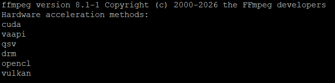

# FFmpeg 8.1 for Synology DSM 7.2+ - Hardware Acceleration Edition

## Package Overview

FFmpeg 8.1 compiled with comprehensive hardware acceleration support for Synology NAS systems running DSM 7. This custom build enables GPU-accelerated video encoding and decoding across NVIDIA, Intel, and AMD hardware platforms.

**Version:** 8.1-1  
**Maintainer:** AuxXxilium  
**Architecture:** x64-7.2 (apollolake, broadwell, denverton and compatible)  
**Build System:** spksrc (SynoCommunity framework)



## Hardware Acceleration Features

### NVIDIA GPU Support
- **NVENC** - Hardware-accelerated H.264/HEVC encoding (up to 8K)
- **NVDEC** - Hardware-accelerated video decoding
- **CUVID** - CUDA Video Decode API
- **CUDA** - GPU compute acceleration
- **Requirements:** NVIDIA GPU with driver 550.54.14+ (supports API 12.2)
- **Performance:** 50-100x realtime encoding speeds on modern GPUs

### Intel Quick Sync Video (QSV)
- **libmfx** - Intel Media SDK integration
- **H.264/HEVC** encoding and decoding
- **VP9** encoding support
- **Hardware scaling** and color conversion
- **Requirements:** Intel CPU with integrated graphics (6th gen or newer recommended) or Arc GPU
- **Performance:** 20-40x realtime encoding speeds

### VAAPI (Intel & AMD)
- **VA-API** - Video Acceleration API
- **Intel** - iGPU and Arc GPU support
- **AMD** - iGPU and Radeon GPU support
- **DRM/libdrm** - Direct Rendering Manager integration
- **Hardware formats:** NV12, P010, YUV420P

### Cross-Platform Acceleration
- **Vulkan** - Cross-platform GPU compute (Intel, NVIDIA, AMD)
- **OpenCL** - GPU compute for filters and processing

## Video Codecs & Formats

### Encoders
- **H.264/AVC** - Software (x264) + Hardware (NVENC, QSV, VAAPI)
- **H.265/HEVC** - Software (x265) + Hardware (NVENC, QSV, VAAPI)
- **VP8/VP9** - Software (libvpx) + Hardware (QSV for VP9)
- **AV1** - Software (libaom, libsvtav1)
- **ProRes** - Professional codec support
- **MPEG-2/4** - Legacy codec support

### Decoders
- **Hardware-accelerated:**
  - NVIDIA: H.264, HEVC, VP8, VP9, MPEG-2/4, VC-1
  - Intel QSV: H.264, HEVC, VP9, MPEG-2, VC-1
  - VAAPI: H.264, HEVC, VP8, VP9, MPEG-2

### Audio Codecs
- **AAC** - Native + libfdk-aac (high-quality)
- **MP3** - LAME encoder
- **Opus** - Modern low-latency codec
- **FLAC** - Lossless compression
- **AC3/EAC3** - Dolby Digital
- **Vorbis** - Open-source codec
- **AMR-NB/WB** - Voice codecs

## Known Limitations

1. **NVIDIA Support**
   - Requires manual NVIDIA community driver installation
   - Driver must be 550.54.14+

2. **Intel QSV**
   - Requires recent Intel CPU (6th gen+)
   - Some older Synology models have limited QSV features

3. **AMD VAAPI**
   - Limited support on Synology hardware
   - Requires proper AMD GPU driver installation

[Download](#download)

---

# SynoCli Videodriver for Synology DSM 7.2+ - Hardware Acceleration Edition

## Package Overview

Synocli VideoDriver is a comprehensive GPU driver package for Synology NAS systems running DSM 7.2, providing Intel hardware acceleration support for video codec operations. This package ensures optimal video transcoding and encoding capabilities across compatible Intel hardware platforms.

**Version:** 1.6.0-0  
**Maintainer:** AuxXxilium  
**Architecture:** x64-7.2 (apollolake, broadwell, denverton and compatible)  
**Build System:** spksrc (SynoCommunity framework)

## Hardware Support

### Intel Graphics Drivers
- **Intel Media Driver** - Hardware-accelerated video encoding and decoding
- **Intel Compute Runtime** - GPU compute acceleration for video processing
- **Level Zero Driver** - Modern GPU compute interface
- **libmfx (Intel Media SDK)** - Hardware media encoding/decoding library
- **Supported Platforms:** Intel integrated graphics (6th gen or newer recommended), Intel Arc GPUs
- **Capabilities:** H.264, HEVC, VP9 encoding and decoding support

### Driver Components
- **GPU Monitoring** - System utilities for GPU status and performance tracking
- **Hardware Scaling** - Accelerated video resolution conversion
- **Color Space Conversion** - Hardware-accelerated YUV/RGB transformations
- **DRM Support** - Direct Rendering Manager for unified hardware access

[Download](#download)

---

# More Information

## Download

- **Xpenology Apps:** Add ```https://apps.xpenology.tech``` to your DSM Package Center -> Settings -> Package Sources

## Support & Resources

- **GitHub:** https://github.com/AuxXxilium
- **Website:** https://auxxxilium.tech
- **Issues:** Report bugs via [Discord (Community)](https://community.xpenology.tech)

## License

FFmpeg is licensed under the **GNU GPL v3** (with optional codecs enabled).

This package includes:
- **GPL libraries:** x264, x265, fdk-aac
- **LGPL libraries:** Most other components
- **Non-free:** NVIDIA NVENC/CUVID support